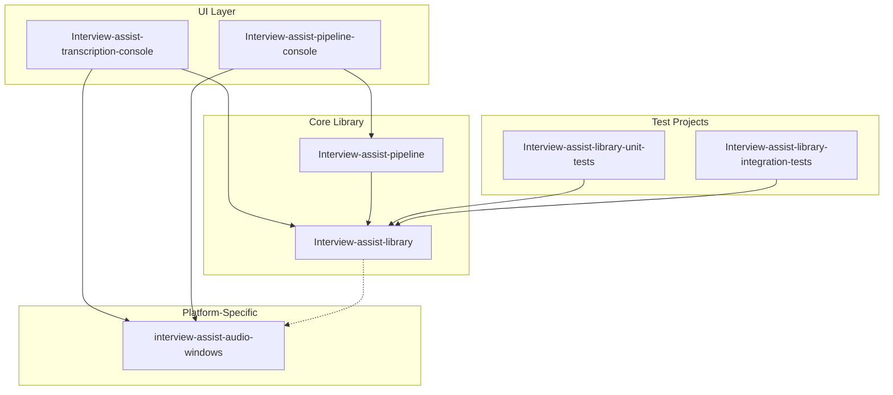

# Software Architecture Document (SAD)

**Project:** Interview Assist
**Version:** 1.0
**Last Updated:** 2026-01-29
**Template:** arc42 lite

---

## 1. Introduction and Goals

### 1.1 Purpose

Interview Assist is a real-time interview assistance application that captures audio from microphone and system loopback, transcribes speech using OpenAI's Realtime API, and provides AI-powered responses to help users during technical interviews.

### 1.2 Quality Goals

| Priority | Quality Goal | Description |
|----------|--------------|-------------|
| 1 | Low Latency | Real-time transcription with minimal delay (<500ms) |
| 2 | Reliability | Graceful handling of connection drops with auto-reconnect |
| 3 | Extensibility | Platform-agnostic core with pluggable audio capture |
| 4 | Testability | Core logic separated from platform concerns |

### 1.3 Stakeholders

| Role | Expectations |
|------|--------------|
| End User | Accurate transcription, helpful AI suggestions |
| Developer | Clean interfaces, easy to extend and test |

---

## 2. Constraints

### 2.1 Technical Constraints

| Constraint | Rationale |
|------------|-----------|
| .NET 8.0+ runtime | Modern C# features, cross-platform potential |
| Windows-only audio capture | NAudio library dependency for low-level audio APIs |
| OpenAI API dependency | Realtime API provides transcription + AI response |
| WebSocket protocol | Required by OpenAI Realtime API |

### 2.2 Organizational Constraints

| Constraint | Rationale |
|------------|-----------|
| Single developer | Prefer simplicity over abstraction |
| No cloud deployment | Desktop-only application |

---

## 3. Context and Scope

### 3.1 Business Context


### 3.2 Technical Context

| Interface | Protocol | Data Format |
|-----------|----------|-------------|
| OpenAI Realtime API | WebSocket (wss://) | JSON messages, Base64 audio |
| Audio Capture | NAudio events | 16kHz mono PCM16 |
| UI Events | .NET events | Strongly-typed delegates |

---

## 4. Solution Strategy

### 4.1 Key Decisions

| Decision | Approach | See ADR |
|----------|----------|---------|
| API Communication | WebSocket with OpenAI Realtime API | [ADR-001](decisions/ADR-001-realtime-api-websocket.md) |
| Audio Capture | NAudio library for Windows | [ADR-002](decisions/ADR-002-audio-capture-naudio.md) |
| Question Detection | LLM-based detection using GPT models | [ADR-003](decisions/ADR-003-question-detection-llm.md) |
| Streaming Transcription | Multi-mode stability tracking | [ADR-005](decisions/ADR-005-streaming-transcription-modes.md) |

### 4.2 Technology Stack

| Layer | Technology |
|-------|------------|
| Core Library | .NET 8.0, System.Net.WebSockets |
| Audio Capture | NAudio (Windows-specific) |
| Pipeline | Whisper STT + GPT-4 Chat API |
| Console UI | .NET Console App |
| Testing | xUnit, Moq |

---

## 5. Building Block View

### 5.1 Level 1: Solution Structure



### 5.2 Level 2: Core Library Components


### 5.3 Key Interfaces

#### IRealtimeApi

Main abstraction for OpenAI Realtime API interaction.

```csharp
public interface IRealtimeApi : IAsyncDisposable
{
    // Lifecycle events
    event Action? OnConnected;
    event Action? OnReady;
    event Action? OnDisconnected;
    event Action? OnReconnecting;

    // Content events
    event Action<string>? OnUserTranscript;
    event Action<string>? OnAssistantTextDelta;
    event Action<string, string, string>? OnFunctionCallResponse;

    Task StartAsync(CancellationToken cancellationToken);
    Task StopAsync();
    Task SendTextAsync(string text, bool requestResponse = true, bool interrupt = false);
    bool IsConnected { get; }
}
```

#### IRealtimeSink

Observer pattern for consuming API events with automatic wiring.

```csharp
public interface IRealtimeSink : IDisposable
{
    void OnConnected();
    void OnReady();
    void OnDisconnected();
    void OnUserTranscript(string text);
    void OnAssistantTextDelta(string delta);
    // ... additional event handlers
}

// Usage: var wiring = sink.WireToApi(api);
```

#### IAudioCaptureService

Platform-specific audio input abstraction.

```csharp
public interface IAudioCaptureService : IDisposable
{
    event Action<byte[]>? OnAudioChunk;
    void SetSource(AudioInputSource source);  // Microphone or Loopback
    void Start();
    void Stop();
}
```

---

## 6. Runtime View

### 6.1 Audio Processing Pipeline


### 6.2 Connection Lifecycle


---

## 7. Crosscutting Concepts

### 7.1 Concurrency Model

| Component | Strategy |
|-----------|----------|
| WebSocket Receive | Dedicated background Task |
| Audio Send | Dedicated background Task with bounded Channel |
| Event Dispatch | Channel-based async queue (protects from subscriber exceptions) |
| UI Updates | `MainThread.BeginInvokeOnMainThread()` |

### 7.2 Error Handling

- WebSocket errors trigger reconnection with exponential backoff
- Audio capture errors are logged but don't crash the app
- Subscriber exceptions are caught by the event dispatcher

### 7.3 Configuration

| Source | Purpose |
|--------|---------|
| `appsettings.json` | Default settings |
| Environment variables | `OPENAI_API_KEY` |
| User secrets | Development credentials |
| `RealtimeApiOptions` | Runtime configuration for Realtime API mode |
| `PipelineApiOptions` | Runtime configuration for Pipeline mode |
| `QuestionDetectionOptions` | Question detection settings (when enabled) |

### 7.4 Question Detection (Optional)

Question detection is an **optional feature** controlled via dependency injection. If `IQuestionDetectionService` is not registered, detection is disabled and only transcription occurs.

#### Configuration (appsettings.json)

```json
{
  "QuestionDetection": {
    "Enabled": true,
    "Model": "gpt-4o-mini",
    "ConfidenceThreshold": 0.7
  }
}
```

#### DI Registration

```csharp
// Enable question detection (call BEFORE AddInterviewAssistPipeline)
if (config.GetValue<bool>("QuestionDetection:Enabled", true))
{
    services.AddQuestionDetection(opts => opts
        .WithApiKey(apiKey)
        .WithModel("gpt-4o-mini")
        .WithConfidenceThreshold(0.7));
}

// Add pipeline (picks up detection service if registered)
services.AddInterviewAssistPipeline(opts => opts.WithApiKey(apiKey));
```

#### Console Apps (without full DI)

```csharp
// Create detector only if enabled
QuestionDetector? detector = detectionEnabled
    ? new QuestionDetector(apiKey, model, confidence)
    : null;

// Pass to pipeline (null = detection disabled)
var pipeline = new InterviewPipeline(audio, apiKey, questionDetector: detector);
```

#### Key Interfaces

| Interface | Purpose |
|-----------|---------|
| `IQuestionDetectionService` | Detects questions in transcript text |
| `QuestionDetectionOptions` | Configuration for detection (Model, ConfidenceThreshold) |
| `QuestionDetectionOptionsBuilder` | Fluent builder for configuration |

### 7.5 Streaming Transcription (Optional)

Streaming transcription provides stability-aware text tracking with three modes that trade off latency vs accuracy. See [ADR-005](decisions/ADR-005-streaming-transcription-modes.md) for design rationale.

#### Modes

| Mode | Latency | Accuracy | Use Case |
|------|---------|----------|----------|
| **Basic** | Low | Standard | Simple applications, high-quality audio |
| **Revision** | Medium | High | Accuracy-critical, acceptable delay |
| **Streaming** | Lowest | Good | Real-time display, acceptable errors |

#### Switching Modes

**Command Line:**

```bash
# Basic mode (all text immediately stable)
Interview-assist-transcription-console --streaming --mode basic

# Revision mode (overlapping batches, local agreement)
Interview-assist-transcription-console --mode revision

# Streaming mode (rapid hypothesis, stability tracking)
Interview-assist-transcription-console --mode streaming

# With vocabulary prompting (improves technical term accuracy)
Interview-assist-transcription-console --mode revision --vocab "C#, async, await"

# With microphone input
Interview-assist-transcription-console --mode revision --mic
```

**appsettings.json:**

```json
{
  "Transcription": {
    "UseStreaming": true,
    "Mode": "Revision",
    "VocabularyPrompt": "C#, async, await, IEnumerable",

    "Basic": { "BatchMs": 3000, "MaxBatchMs": 6000 },

    "Revision": {
      "OverlapMs": 1500,
      "BatchMs": 2000,
      "AgreementCount": 2,
      "SimilarityThreshold": 0.85
    },

    "Hypothesis": {
      "MinBatchMs": 500,
      "UpdateIntervalMs": 250,
      "StabilityIterations": 3,
      "StabilityTimeoutMs": 2000,
      "FlickerCooldownMs": 100
    }
  }
}
```

**DI Registration:**

```csharp
services.AddStreamingTranscription(opts => opts
    .WithApiKey(apiKey)
    .WithMode(TranscriptionMode.Revision)
    .WithContextPrompting(true, maxChars: 200, vocabulary: "C#, async")
    .WithRevisionOptions(overlapMs: 1500, agreementCount: 2));
```

#### Key Interfaces

| Interface | Purpose |
|-----------|---------|
| `IStreamingTranscriptionService` | Stability-aware transcription with events |
| `StreamingTranscriptionOptions` | Configuration for all modes |
| `StreamingTranscriptionOptionsBuilder` | Fluent builder for configuration |
| `StableTextEventArgs` | Confirmed text that won't change |
| `ProvisionalTextEventArgs` | Text that may be revised |
| `HypothesisEventArgs` | Full hypothesis with stability ratio |

#### Event Flow

```
Audio → Whisper API → TranscriptionTextComparer
                            ↓
              ┌─────────────┴─────────────┐
              ↓                           ↓
        OnStableText              OnProvisionalText
        (white text)               (gray text)
              ↓                           ↓
              └─────────────┬─────────────┘
                            ↓
                    OnFullHypothesis
                  (stable + provisional)
```

---

## 8. Architecture Decisions

See the [decisions/](decisions/) directory for Architecture Decision Records (ADRs):

| ADR | Title | Status |
|-----|-------|--------|
| [ADR-001](decisions/ADR-001-realtime-api-websocket.md) | Realtime API via WebSocket | Accepted |
| [ADR-002](decisions/ADR-002-audio-capture-naudio.md) | Audio Capture with NAudio | Accepted |
| [ADR-003](decisions/ADR-003-question-detection-llm.md) | LLM-based Question Detection | Accepted |
| [ADR-004](decisions/ADR-004-pipeline-vs-realtime.md) | Pipeline vs Realtime Implementation | Accepted |
| [ADR-005](decisions/ADR-005-streaming-transcription-modes.md) | Streaming Transcription Modes | Accepted |

---

## 9. Risks and Technical Debt

| Risk/Debt | Impact | Mitigation |
|-----------|--------|------------|
| Windows-only audio | Limits platform reach | IAudioCaptureService abstraction allows future implementations |
| OpenAI API dependency | Single vendor lock-in | IRealtimeApi abstraction could support alternative providers |
| No offline mode | Requires internet | Out of scope for v1 |

---

## 10. Glossary

| Term | Definition |
|------|------------|
| Loopback | System audio capture (what you hear through speakers) |
| VAD | Voice Activity Detection - detects when user is speaking |
| Realtime API | OpenAI's WebSocket-based API for real-time audio/text |
| Sink | Observer that receives and handles events from a source |
| PCM | Pulse Code Modulation - raw audio format |
