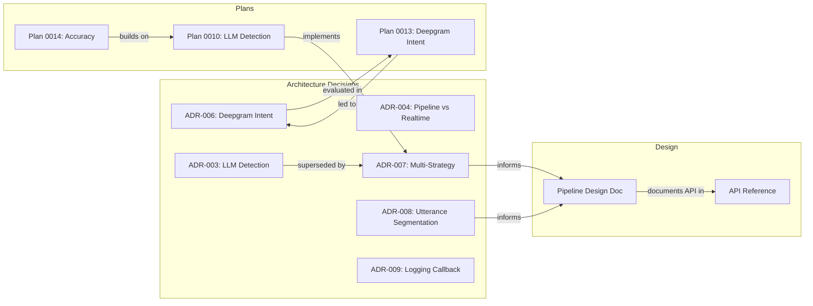

# Interview Assist Documentation

## Quick Start
- [Getting Started](operations/getting-started.md)
- [Configuration Guide](operations/appsettings.md)
- [Troubleshooting](operations/troubleshooting.md)

## Architecture
- [Software Architecture Document](architecture/SAD.md)
- [Architecture Decision Records](architecture/decisions/README.md)
  - [ADR-001: Realtime API WebSocket](architecture/decisions/ADR-001-realtime-api-websocket.md)
  - [ADR-002: Audio Capture NAudio](architecture/decisions/ADR-002-audio-capture-naudio.md)
  - [ADR-003: Question Detection LLM](architecture/decisions/ADR-003-question-detection-llm.md) *(superseded by ADR-007)*
  - [ADR-004: Pipeline vs Realtime](architecture/decisions/ADR-004-pipeline-vs-realtime.md)
  - [ADR-005: Streaming Transcription Modes](architecture/decisions/ADR-005-streaming-transcription-modes.md) *(superseded)*
  - [ADR-006: Deepgram Intent Recognition](architecture/decisions/ADR-006-deepgram-intent-recognition.md) *(evaluated — unsuitable)*
  - [ADR-007: Multi-Strategy Intent Detection](architecture/decisions/ADR-007-multi-strategy-intent-detection.md)
  - [ADR-008: Utterance Segmentation](architecture/decisions/ADR-008-utterance-segmentation.md)
  - [ADR-009: Logging Action Callback](architecture/decisions/ADR-009-logging-action-callback.md)

## Design
- [Utterance-Intent Pipeline](design/DESIGN-utterance-intent-pipeline.md)
- [API Reference](design/api-reference.md)

## Domain Knowledge
- [Deepgram Integration](domain/deepgram-overview.md)
- [Question Detection - Heuristic](domain/heuristic-question-detector.md)
- [Question Detection - Research Report](domain/question-detection-research-report.md)
- [Transcript-to-Question Mapping Issues](domain/transcript-question-mapping-issues.md)

## Operations
- [Getting Started](operations/getting-started.md)
- [Configuration](operations/appsettings.md)
- [Rate Limiting](operations/rate-limiting.md)
- [Troubleshooting](operations/troubleshooting.md)

## Instructions
- [Evaluation & Testing](instructions/EvaluationInstructions.md)

## Ideas
- [F# Candidate Components (2026-02-09)](ideas/2026-02-09-fsharp-candidate-components.md)
- [Evaluation Visualisation and Improvements (2026-02-09)](ideas/2026-02-09-evaluation-visualisation-and-improvements.md)
- [Ground Truth Annotation Tool (2026-02-09)](ideas/2026-02-09-ground-truth-annotation-tool.md)

## Development Plans

### In-Progress
- [IMPROVEMENT-PLAN-0014: LLM Detection Accuracy](plans/in-progress/IMPROVEMENT-PLAN-0014-llm-detection-accuracy.md)
- [Refactoring Report](plans/in-progress/REFACTORING-REPORT.md)

### Completed
- [IMPROVEMENT-PLAN-0016: File Naming Convention](plans/completed/IMPROVEMENT-PLAN-0016-file-naming-convention.md)
- [IMPROVEMENT-PLAN-0015: Ground Truth Source Tracking](plans/completed/IMPROVEMENT-PLAN-0015-ground-truth-source-tracking.md)
- [IMPROVEMENT-PLAN-0013: Deepgram Intent Recognition](plans/completed/IMPROVEMENT-PLAN-0013-deepgram-intent-recognition.md)
- [IMPROVEMENT-PLAN-0012: Advanced Evaluation](plans/completed/IMPROVEMENT-PLAN-0012-advanced-evaluation.md)
- [IMPROVEMENT-PLAN-0011: Evaluation Mode](plans/completed/IMPROVEMENT-PLAN-0011-evaluation-mode.md)
- [IMPROVEMENT-PLAN-0010: LLM Intent Detection](plans/completed/IMPROVEMENT-PLAN-0010-llm-intent-detection.md)
- [IMPROVEMENT-PLAN-0009: Question Detection](plans/completed/IMPROVEMENT-PLAN-0009-question-detection.md)
- [IMPROVEMENT-PLAN-0008: Record & Playback](plans/completed/IMPROVEMENT-PLAN-0008-record-playback.md)

### Dropped
- [IMPROVEMENT-PLAN-0007: Intent Detection Quality](plans/dropped/IMPROVEMENT-PLAN-0007.md) — superseded by multi-strategy detection (ADR-007)
- [IMPROVEMENT-PLAN-0004: Transcription Quality](plans/dropped/IMPROVEMENT-PLAN-0004.md) — superseded by Deepgram streaming + utterance pipeline

---

## Document Relationship Map

